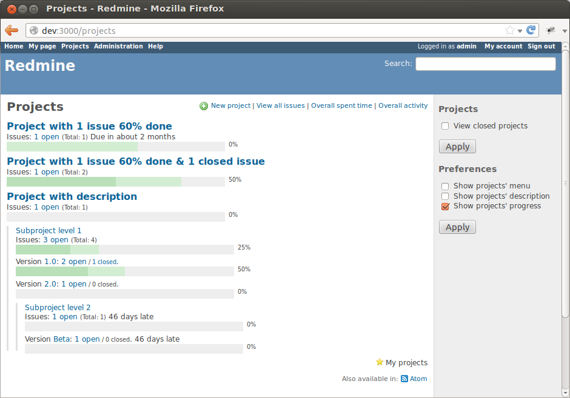

Latest version 0.5.0 released 2013-05-20.

Features
--------

- Show overall projects status in progress bars
- Show project status in progress bars at project overview page
- Quick links to issues, new issue, version, etc directly from the projects list
- Show due date of the projects and versions
- Recently viewed projects sidebar block
- Configurable: admin set default settings, user may override them per session
- Compatible with [Redmine](http://www.redmine.org/) 2.1, 2.2, 2.3 and [ChiliProject](https://www.chiliproject.org/) 3.4
- Translated into English, Russian, Ukrainian, German, French

Screenshots
-----------
### Projects list showing overall projects status with progress bars

[View more screenshots...](screenshots.html)

Installation notes
------------------

Plugin's directory should be named `progressive_projects_list` exactly.
Other installation instructions are generic and can be found at [Redmine Plugins page](http://www.redmine.org/projects/redmine/wiki/Plugins).

Links
-----

- [Plugin page @ Redmine.org](http://www.redmine.org/plugins/progressive-projects-list)
