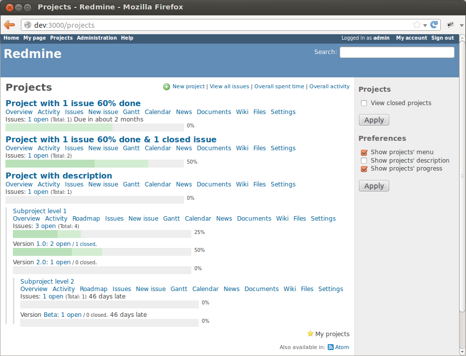
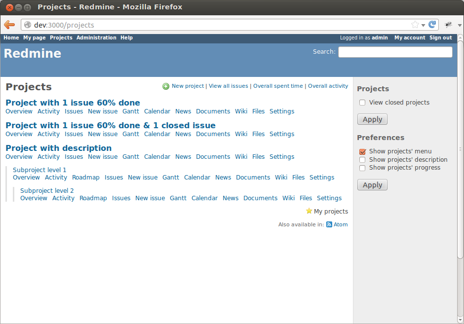
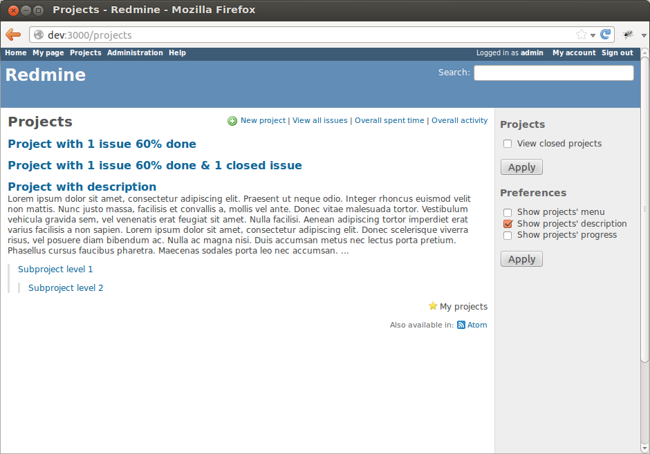
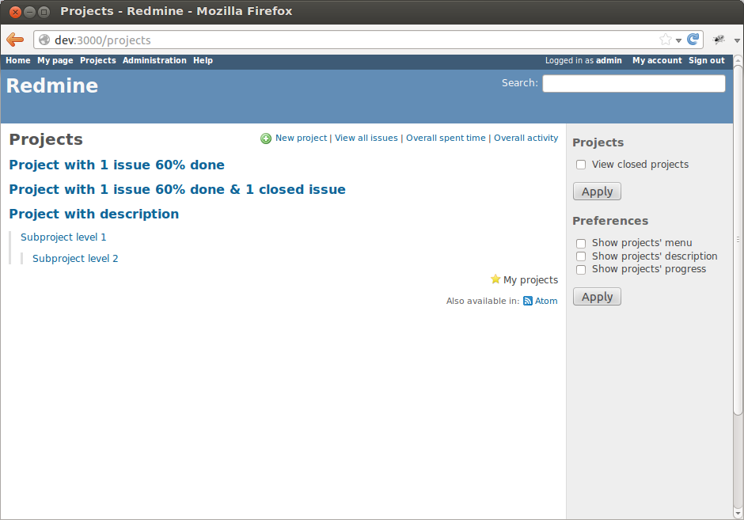
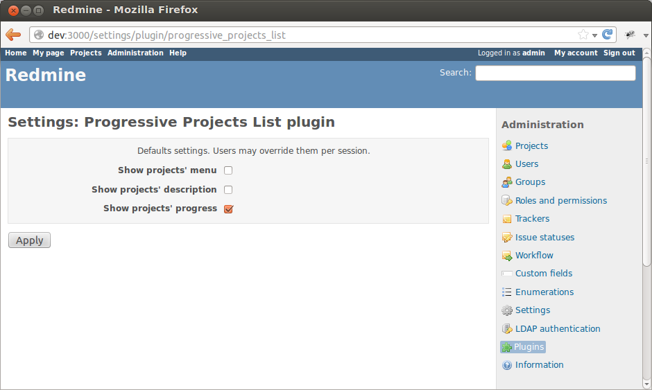

Screenshots
-----------
### Projects list showing overall projects status with progress bars

### Projects list with progress bars and menus

### Projects list with menus

### Projects list with descriptions (default Redmine view)

### Projects list with menus, progress bars and descriptions

### Projects list without anythig

### Projects list admin settings

